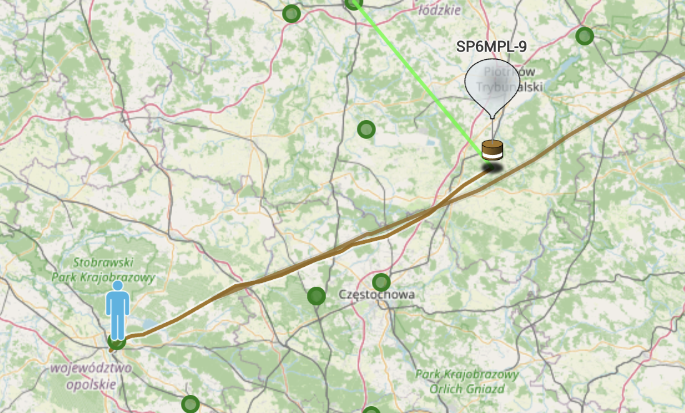
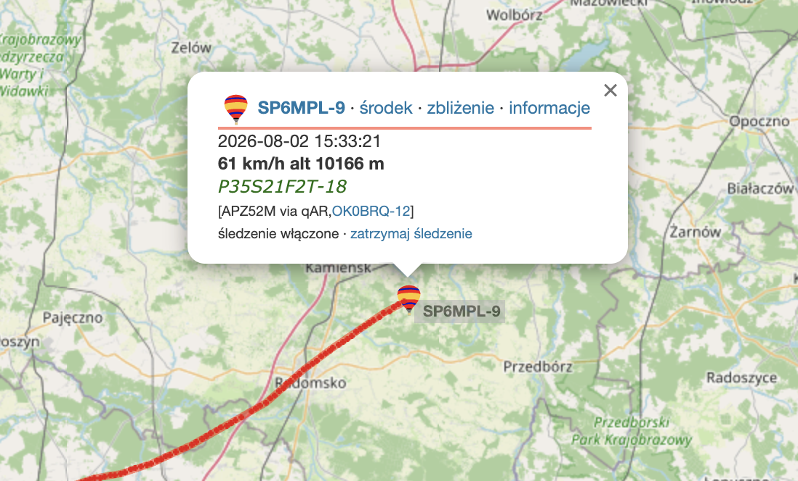

# RPI-Pico-LoRaAPRS-Tracker-For-Ham-Amateur-Pico-Balloons
I created this software to enable **LoRa APRS** transmissions using the affordable **Raspberry Pi Pico** microcontroller and a few inexpensive, widely available components.

The project was primarily designed for **pico balloon** missions—small high-altitude balloons capable of remaining in the atmosphere for several months. During that time, they can complete several, or even dozens of, circumnavigations of the Earth.

This project uses a **Raspberry Pi Pico** microcontroller, an **RFM98** LoRa transceiver, an **ATGM336H-5N31** GPS receiver, and two resistors.

A complete wiring diagram along with detailed build and compilation instructions will be added soon.

**Note:** This project was developed with the assistance of artificial intelligence.

