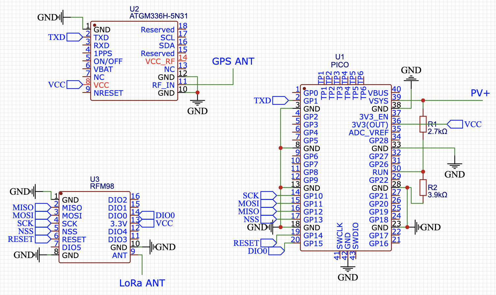

# RPI-Pico-LoRaAPRS-Tracker-For-Ham-Amateur-Pico-Balloons
# Project Overview

This software was created to enable **LoRa APRS** transmissions using the affordable **Raspberry Pi Pico** microcontroller and a few inexpensive, widely available components.

The project was primarily designed for **pico balloon** missions—small high-altitude balloons capable of remaining in the atmosphere for several months. During that time, they can complete several, or even dozens of, circumnavigations of the Earth.

The project uses the following hardware:

* Raspberry Pi Pico
* RFM98 LoRa transceiver
* ATGM336H-5N31 GPS receiver
* Two resistors 2.7k and 3.9k

## Wiring and Compilation

The wiring diagram is provided below.

To build the project:

1. Open the project in **Arduino IDE**.
2. Select the **Raspberry Pi Pico** board.
3. Configure the project settings to match your requirements (callsign, frequency, transmission interval, etc.).
4. Compile the project.
5. Copy the generated **UF2** file to your Raspberry Pi Pico.

> **Note:** Transmitting on amateur radio bands requires a valid amateur radio operator licence and must comply with the radio regulations in your country.
